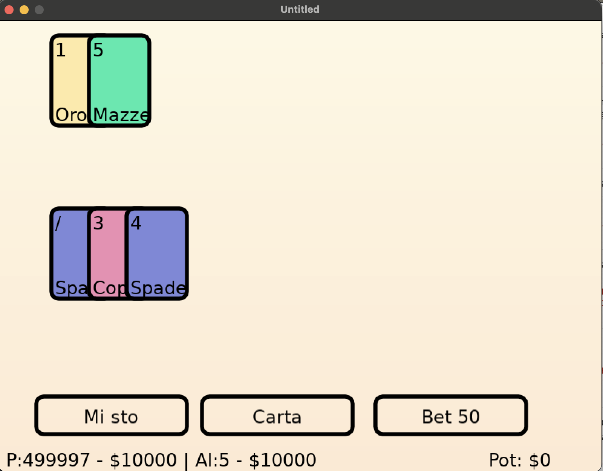

# 7 /
Digital version of the italian "7 e mezzo" made in a few hours to get acquaintanted with Love2d and Lua.



## Run

```bash
make install-submodule # Install submodules
make dev # to run
make build-love # to build .love file
```

## Libs
- Live reload with: https://github.com/patrixr/lovelier
- Scene State management: https://github.com/paltze/scenery

## Debugging / console
- https://github.com/flamendless/lovedebug
- https://github.com/rxi/lovebird


## How to
IE: Add submodules with:
`git submodule add https://github.com/S-Walrus/hex2color/ lib/hex2color`


## Interesting packages
https://github.com/simplifylabs/love-packager
https://github.com/1bardesign/batteries/
https://github.com/deltadaedalus/vudu?tab=readme-ov-file
https://gist.githubusercontent.com/paulmoore/1429475/raw/2666f9913a0ffb1912fd9b86f9bb0bbb99153d07/classes.lua

## Ideas

Make 7 / a ppv experience, player have life. Winning a round will hit the enemy.
- Add special cards such as:
    - Armor +1
    - Hit +1
    - See the next 2 cards in the deck, a random card in your hand gets destroyed
    - etc..
- Bet system